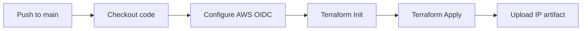
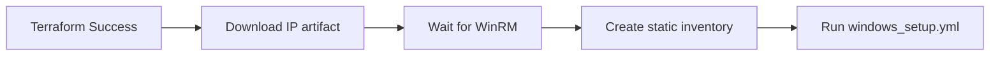

# AWS Windows Spot EC2 — Terraform + Ansible CI/CD

> End-to-end automation: provisions a Windows Spot EC2 instance via Terraform, then configures it via Ansible over WinRM — all driven by GitHub Actions using AWS OIDC. No long-lived AWS credentials stored in GitHub.

---

## Table of Contents

1. [What This Project Does](#what-this-project-does)
2. [Architecture](#architecture)
3. [Prerequisites](#prerequisites)
4. [One-Time Setup](#one-time-setup)
5. [CI/CD Pipeline](#cicd-pipeline)
6. [Local Development](#local-development)
7. [Enterprise Benefits](#enterprise-benefits)
8. [Security Considerations](#security-considerations)
9. [File Reference](#file-reference)
10. [Troubleshooting](#troubleshooting)

---

## What This Project Does

| Stage | What happens |
|-------|-------------|
| **Terraform** | Creates a Windows Spot EC2 instance in the default VPC using the latest Windows Server 2022 AMI. Sets up a security group (RDP + WinRM), IAM instance profile (SSM), and tags the instance with a `Project` tag. |
| **UserData** | On first boot, creates a local `ansible_admin` user and configures WinRM (HTTP/5985) with basic auth enabled so Ansible can connect. |
| **Ansible** | Waits for WinRM to be ready, then connects via WinRM, creates `C:\TestDirectory\test.txt` with a timestamp, and verifies the file was written. |
| **Destroy** | Tears down all AWS resources — IAM role, OIDC provider, S3 bucket, EC2 key pair, and the Spot instance. Triggered manually via GitHub Actions `workflow_dispatch`. |

---

## Architecture

```
GitHub Repository
│
▼  push to main
.github/workflows/
│
├── 01-terraform-apply.yml     ← Terraform init + apply → Windows Spot EC2
│   (uploads public IP as artifact)
│
├── 02-ansible.yml             ← Triggered on workflow_run after Terraform succeeds
│   (downloads IP, waits for WinRM, runs windows_setup.yml playbook)
│
└── 03-terraform-destroy.yml   ← Manual workflow_dispatch only (requires input: destroy)
    (terraform destroy -auto-approve)
```

### Resource Flow

```
┌─────────────────────────────────────────────────────────────────┐
│                        GitHub Actions                            │
│  ┌──────────────────┐    ┌──────────────────┐                  │
│  │ Terraform Create │───▶│ Ansible Provision│                  │
│  └──────────────────┘    └──────────────────┘                  │
│          │                       │                              │
└──────────│───────────────────────│──────────────────────────────┘
           │                       │
           ▼                       ▼
    ┌────────────────┐     ┌──────────────────┐
    │  AWS Spot EC2  │     │  WinRM (5985)    │
    │  Windows 2022  │     │  ansible_admin   │
    │  Default VPC   │     │  Basic Auth      │
    └────────────────┘     └──────────────────┘

    ┌─────────────────────────────────────────────────┐
    │  AWS IAM                                         │
    │  • OIDC Identity Provider (token.actions.githubusercontent.com)
    │  • Role: github-actions-oidc-role               │
    │  • Policies: EC2Full, S3Full, IAMFull, DynamoDBFull
    │  • EC2 Instance Profile (for SSM)               │
    └─────────────────────────────────────────────────┘

    ┌─────────────────────────────────────────────────┐
    │  AWS S3 (Terraform Backend)                     │
    │  • Bucket: aws-oidc-win-terraform-ansible-cicd-YYYYMMDD
    │  • Object Lock (GOVERNANCE, 7 days)             │
    │  • Versioning + SSE-KMS encryption              │
    └─────────────────────────────────────────────────┘
```

---

## Prerequisites

### 1. Local Machine Tools

Install the following on your laptop/workstation:

| Tool | Version | Purpose | Install |
|------|---------|---------|---------|
| **AWS CLI** | v2 | Configure AWS credentials, inspect resources | [docs.aws.amazon.com/cli](https://docs.aws.amazon.com/cli/latest/userguide/install-cliv2.html) |
| **Terraform** | ≥ 1.5.0 | Provision AWS infrastructure | [terraform.io/download](https://www.terraform.io/download) |
| **Git** | any recent | Version control | [git-scm.com](https://git-scm.com/book/en/v2/Getting-Started-Installing-Git) |
| **Python** | 3.10+ | Run dynamic inventory script locally | [python.org](https://www.python.org/downloads/) |
| **GitHub CLI** | ≥ 2.0 | Set GitHub secrets from terminal | [cli.github.com](https://cli.github.com/manual/installation) |
| **Bash** | any recent | Run setup scripts | Usually pre-installed on macOS/Linux; use WSL2 on Windows |

### 2. AWS Account

- An AWS account with permissions to create: IAM roles, S3 buckets, EC2 key pairs, and spot instances.
- The account **cannot** be a bare personal account used for production workloads (best practice: use a dedicated Dev/Test account).
- Note your **AWS Account ID** (visible in the AWS console top-right or via `aws sts get-caller-identity --query Account --output text`).

### 3. GitHub Repository

- A GitHub repository under your GitHub organization.
- **GitHub Pro+** recommended for environment protection rules and secret scoping, though not strictly required.
- Permissions: `repo` scope for OIDC token generation.

### 4. One-time AWS + GitHub Setup (see next section)

---

## One-Time Setup

Run these scripts **once** to provision the foundational AWS resources and configure GitHub Secrets. After that, every push to `main` triggers the full CI/CD pipeline automatically.

### Before You Begin

Edit the configuration section at the top of each script before running:

```bash
# In ALL three scripts, update these to match your environment:
GITHUB_ORG="mrbalraj007"                                    # Your GitHub org/user
GITHUB_REPO="aws-oidc-win-terraform-ansible-cicd"          # Your repo name
AWS_REGION="us-east-1"                                      # AWS region
```

---

### Script 1 — Configure AWS OIDC Identity Provider

```bash
chmod +x scripts/01_setup_aws_oidc.sh
./scripts/01_setup_aws_oidc.sh
```

**What it creates in AWS:**
- OIDC Identity Provider: `token.actions.githubusercontent.com` (for GitHub OIDC federation)
- IAM Role: `github-actions-oidc-role` with a trust policy scoped to your repo
- IAM Role Policy Attachments:
  - `AmazonEC2FullAccess`
  - `AmazonS3FullAccess`
  - `IAMFullAccess`
  - `AmazonDynamoDBFullAccess`

**What it outputs:**
```
GitHub Secret to create:
  AWS_ROLE_ARN = arn:aws:iam::123456789012:role/github-actions-oidc-role
```

---

### Script 2 — Create S3 Backend for Terraform State

```bash
chmod +x scripts/02_setup_s3_backend.sh
./scripts/02_setup_s3_backend.sh
```

**What it creates in AWS:**
- S3 Bucket: `<GITHUB_REPO>-<YYYYMMDD>` (e.g., `aws-oidc-win-terraform-ansible-cicd-20260608`)
- S3 Versioning: enabled
- S3 Object Lock: GOVERNANCE mode, 7-day retention
- S3 Encryption: SSE-KMS (AWS managed key)

> **Why Object Lock?** Terraform state may contain sensitive data (AMI IDs, IPs). Object Lock prevents deletion for the retention period, protecting state integrity.

**What it outputs:**
```
GitHub Secret to create:
  TF_VAR_tf_state_bucket = aws-oidc-win-terraform-ansible-cicd-20260608
```

---

### Script 3 — Create EC2 Key Pair + GitHub Secrets

```bash
chmod +x scripts/03_create_ec2_keypair.sh
./scripts/03_create_ec2_keypair.sh
```

**What it creates in AWS:**
- EC2 Key Pair: `terraform-ansible-demo-key` (RSA 2048-bit)
- Private key saved to: `~/.ssh/terraform-ansible-demo-key.pem` (chmod 600)

**What it sets in GitHub (via `gh` CLI if authenticated):**
- `TF_VAR_key_name = terraform-ansible-demo-key`
- `TF_VAR_ansible_windows_password = MyS0cureP0ss2026`

**What it outputs:**
```
Manual step — add these GitHub Secrets:
  TF_VAR_key_name = terraform-ansible-demo-key
  TF_VAR_ansible_windows_password = MyS0cureP0ss2026
```

> If `gh` is not authenticated, manually add the secrets in GitHub: **Settings → Secrets and variables → Actions → New repository secret**.

---

### Adding GitHub Secrets Manually

Go to: `https://github.com/<GITHUB_ORG>/<GITHUB_REPO>/settings/secrets/actions`

| Secret Name | Value | Example |
|---|---|---|
| `AWS_ROLE_ARN` | Output from script 1 | `arn:aws:iam::123456789012:role/github-actions-oidc-role` |
| `TF_VAR_tf_state_bucket` | Output from script 2 | `aws-oidc-win-terraform-ansible-cicd-20260608` |
| `TF_VAR_key_name` | Output from script 3 | `terraform-ansible-demo-key` |
| `TF_VAR_ansible_windows_password` | Your chosen password | `MyS0cureP0ss2026` |

---

### Python Package Dependencies (for local testing)

If you want to test the dynamic inventory script locally (outside of GitHub Actions):

```bash
pip install boto3 botocore ansible pywinrm
```

> In GitHub Actions, these are installed automatically by `pip install` in the workflow.

---

## CI/CD Pipeline

### Workflow 1 — `01-terraform-apply.yml`

**Trigger:** Push to `main`



**What it does:**
1. Configures AWS credentials via OIDC (no long-lived keys)
2. Runs `terraform init` with S3 backend
3. Runs `terraform apply -auto-approve` — creates the Windows Spot EC2 instance
4. Uploads the public IP as a GitHub Actions artifact named `windows-public-ip`

**Terraform outputs captured:**
- `windows_public_ip` — used by the Ansible workflow
- `windows_instance_id` — Spot instance ID
- `ami_id_used` — Windows AMI used

---

### Workflow 2 — `02-ansible.yml`

**Trigger:** Runs after `01-terraform-apply.yml` completes successfully (`workflow_run` event)



**What it does:**
1. Downloads the `windows-public-ip` artifact from the Terraform workflow run
2. Runs `04_wait_for_winrm.sh` — polls until WinRM port 5985 responds AND `ansible_admin` can authenticate
3. Creates a static `windows_inventory.ini` with the public IP and WinRM vars
4. Runs `ansible-playbook -i windows_inventory.ini ansible/playbooks/windows_setup.yml`

**The `windows_setup.yml` playbook:**
- `ansible.windows.win_ping` — verifies WinRM connectivity
- Creates `C:\TestDirectory` directory
- Creates `C:\TestDirectory\test.txt` with instance metadata
- Reads back and displays the file content as verification

---

### Workflow 3 — `03-terraform-destroy.yml`

**Trigger:** Manual `workflow_dispatch` with input `confirm=destroy`

```bash
# In GitHub Actions UI:
# Actions → "Terraform Destroy" → Run workflow → confirm: destroy
```

**What it does:**
1. Runs `terraform destroy -auto-approve` — terminates the Spot instance and removes all Terraform-managed resources
2. Does NOT remove the S3 bucket (Terraform backend state bucket is managed separately)
3. Use `scripts/05_destroy_resources.sh` for complete cleanup including OIDC, S3 bucket, EC2 key pair, and GitHub secrets

---

## Local Development

### Running Terraform Locally

```bash
cd terraform/

# Initialize with S3 backend
terraform init \
  -backend-config="bucket=<YOUR_BUCKET>" \
  -backend-config="key=terraform-ansible-cicd/terraform.tfstate" \
  -backend-config="region=us-east-1" \
  -backend-config="encrypt=true"

# Plan
terraform plan

# Apply
terraform apply -auto-approve

# Get outputs
terraform output -raw windows_public_ip
```

**Required environment variables or `..auto.tfvars`:**
```hcl
# terraform/terraform.tfvars (do NOT commit this file)
key_name                   = "terraform-ansible-demo-key"
ansible_windows_password   = "MyS0cureP0ss2026"
tf_state_bucket            = "your-bucket-name"
```

### Running Ansible Playbook Locally

```bash
# Set AWS credentials (from your AWS CLI configured profile or environment)
export AWS_ACCESS_KEY_ID="..."
export AWS_SECRET_ACCESS_KEY="..."
export AWS_DEFAULT_REGION="us-east-1"

# Test dynamic inventory
python3 ansible/inventories/aws_ec2_inventory.py --list

# Run playbook against running instances
ANSIBLE_HOST_KEY_CHECKING=False \
ANSIBLE_CONFIG=ansible/ansible.cfg \
ANSIBLE_WINRM_PASSWORD="MyS0cureP0ss2026" \
  ansible-playbook \
    -i ansible/inventories/aws_ec2_inventory.py \
    ansible/playbooks/windows_setup.yml
```

### Testing the Wait-for-WinRM Script

```bash
# Pass IP, max wait seconds, and Ansible password
./scripts/04_wait_for_winrm.sh 3.237.20.199 300 "MyS0cureP0ss2026"
```

### Running the Destroy Script (Complete Cleanup)

```bash
chmod +x scripts/05_destroy_resources.sh
./scripts/05_destroy_resources.sh
```

This removes (in order):
1. IAM Role + attached policies
2. OIDC Identity Provider
3. S3 Bucket (after emptying and disabling Object Lock)
4. EC2 Key Pair
5. Local private key file (`~/.ssh/terraform-ansible-demo-key.pem`)
6. GitHub Secrets (`AWS_ROLE_ARN`, `TF_VAR_tf_state_bucket`, `TF_VAR_key_name`, `TF_VAR_ansible_windows_password`)

---

## Enterprise Benefits

### 1. Zero Long-Lived AWS Credentials

The pipeline uses **AWS OIDC (OpenID Connect)** to exchange GitHub's JWT tokens for temporary AWS credentials. No `AWS_ACCESS_KEY_ID` or `AWS_SECRET_ACCESS_KEY` are ever stored in GitHub Secrets. Credentials expire after each job and are automatically rotated.

**Benefit:** Eliminates the risk of exposed long-lived keys. Even if the OIDC role is compromised, the window of misuse is bounded by the token lifetime (~1 hour).

### 2. Spot Instances — Cost Optimization

Using `aws_spot_instance_request` with `spot_type = "one-time"` can reduce EC2 costs by **60–90%** compared to On-Demand pricing for non-critical workloads.

| Instance Type | On-Demand Hourly | Spot Hourly (approx.) | Savings |
|---|---|---|---|
| t3.micro | ~$0.011 | ~$0.003 | ~70% |
| t3.medium | ~$0.042 | ~$0.012 | ~70% |
| t3.large | ~$0.083 | ~$0.025 | ~70% |

> **Note:** Spot instances can be interrupted with a 2-minute warning via `instance_interruption_behavior = "terminate"`. For production Windows workloads, consider using a Savings Plan or Reserved Instance and switching from `aws_spot_instance_request` to `aws_instance`.

### 3. Immutable Infrastructure

Each pipeline run provisions a **fresh Windows EC2 instance**. There is no configuration drift — if something goes wrong, you destroy and recreate rather than patching.

### 4. Audit Trail

Every Terraform run logs to GitHub Actions. The S3 backend with versioning preserves every version of your Terraform state. Object Lock (GOVERNANCE mode) prevents accidental or malicious state deletion for 7 days.

### 5. Idempotent Teardown

The `05_destroy_resources.sh` script is idempotent — each section checks existence before acting. This makes it safe to re-run if the first attempt failed partway through.

### 6. Scalable to Multiple Environments

The architecture supports multiple GitHub Environments (`dev`, `staging`, `prod`) with environment-specific secrets and protection rules. Add a new environment in GitHub Settings and update the workflow triggers.

### 7. No Manual Intervention for Routine Deployments

Push to `main` → infrastructure is provisioned and configured automatically. No manual RDP into servers to run setup scripts. No shared team credentials to manage.

---

## Security Considerations

### WinRM over HTTP (Development Only)

The current setup uses **WinRM over HTTP (port 5985)** with `AllowUnencrypted=true` and `Basic` authentication. This is intentionally simple for a demo/CI environment.

**For production**, upgrade to:
- **WinRM over HTTPS (port 5986)** with a self-signed or ACM-managed certificate
- **Certificate-based authentication** instead of Basic auth (avoids plaintext password transmission)
- Restrict the security group to only allow port 5986 from your CI runner's IP range (not `0.0.0.0/0`)

### Windows Password

`TF_VAR_ansible_windows_password` is stored as a GitHub Secret. For production:
- Use a password manager to generate and store the password
- Rotate it regularly (automate with Secrets Manager rotation or a script)
- Never log the password value in workflow steps that echo variable contents

### IAM Least Privilege

The IAM role attached to the GitHub OIDC identity has `*FullAccess` policies. For production, scope these down:

| Service | Production Policy |
|---|---|
| EC2 | `AmazonEC2ReadOnlyAccess` + inline policy allowing `Describe*`, `RunInstances`, `TerminateInstances` only |
| S3 | Inline policy allowing only the specific backend bucket |
| IAM | `IAMReadOnlyAccess` + inline policy for the specific role |
| DynamoDB | Not needed if not using DynamoDB locking |

### S3 Bucket Public Access

The S3 backend bucket is private by default. The security group blocks all inbound access to the instance except ports 3389 (RDP) and 5985/5986 (WinRM) from `0.0.0.0/0`. Consider restricting WinRM to GitHub Actions runner IP ranges for production.

---

## File Reference

### Terraform

| File | Purpose |
|------|---------|
| `terraform/main.tf` | AWS provider, data sources (AMI, VPC, subnets), security group, IAM role/profile, Spot instance |
| `terraform/variables.tf` | Input variables: `key_name`, `ansible_windows_password`, `tf_state_bucket`, `aws_region`, `instance_type`, `common_tags` |
| `terraform/outputs.tf` | Exposes `windows_public_ip`, `windows_instance_id`, `spot_request_id`, `ami_id_used` |
| `terraform/userdata.ps1` | PowerShell script that runs on first boot — creates `ansible_admin` user and configures WinRM |

### Ansible

| File | Purpose |
|------|---------|
| `ansible/ansible.cfg` | Ansible configuration — uses dynamic inventory, disables host key checking, sets WinRM timeouts |
| `ansible/inventories/aws_ec2_inventory.py` | Dynamic inventory script — queries EC2 for running Windows instances tagged with `Project=terraform-ansible-demo`, sets WinRM connection vars |
| `ansible/inventories/inventory.ini` | Static fallback inventory (not used in CI) |
| `ansible/playbooks/windows_setup.yml` | Playbook — creates `C:\TestDirectory`, writes `test.txt`, verifies via `win_stat` and `win_shell` |

### Scripts

| File | Purpose |
|------|---------|
| `scripts/01_setup_aws_oidc.sh` | One-time: creates OIDC identity provider + IAM role with trust policy |
| `scripts/02_setup_s3_backend.sh` | One-time: creates S3 bucket with Object Lock, versioning, encryption for Terraform backend |
| `scripts/03_create_ec2_keypair.sh` | One-time: creates EC2 RSA key pair, saves `.pem` locally, sets GitHub secrets |
| `scripts/04_wait_for_winrm.sh` | CI: polls port 5985 and verifies `ansible_admin` can authenticate via WinRM |
| `scripts/05_destroy_resources.sh` | Teardown: removes all resources created by scripts 01–03 in reverse dependency order |

### GitHub Actions Workflows

| File | Trigger | Purpose |
|------|---------|---------|
| `.github/workflows/01-terraform-apply.yml` | Push to `main` | Terraform init + apply → uploads `windows_public_ip` artifact |
| `.github/workflows/02-ansible.yml` | `workflow_run` after Terraform Apply | Downloads IP, waits for WinRM, runs Ansible playbook |
| `.github/workflows/03-terraform-destroy.yml` | Manual `workflow_dispatch` with `confirm=destroy` | Terraform destroy only |

---

## Troubleshooting

### CI Run Fails — "credentials were rejected by the server"

**Symptom:**
```
fatal: [3.237.20.199]: UNREACHABLE!
{"msg": "Task failed: basic: the specified credentials were rejected by the server"}
```

**Cause:** The `ansible_admin` user does not exist yet when Ansible tries to connect.

**Fix:**
1. Check the instance's userdata log at `C:\ProgramData\userdata.log` via RDP
2. Ensure `TF_VAR_ansible_windows_password` matches the password in `03_create_ec2_keypair.sh`
3. Increase wait time in `04_wait_for_winrm.sh` (default 300s) — Windows takes 4–8 minutes to boot

---

### CI Run Fails — "WinRM did not become available"

**Cause:** The wait script exceeded the maximum wait time before WinRM was fully configured.

**Fix:**
1. RDP into the instance and check `C:\ProgramData\userdata.log`
2. If the log shows `UserData completed successfully`, run `winrm enumerate winrm/config/listener` to check the HTTP listener exists
3. Increase `MAX_WAIT` in `04_wait_for_winrm.sh`

---

### Terraform Apply Fails — "Spot instance request failed"

**Cause:** Spot capacity not available in the AZ for the requested instance type.

**Fix:**
1. Try a different `instance_type` in `terraform/variables.tf` (e.g., `t3.medium` instead of `t3.micro`)
2. Try a different AWS region

---

### Terraform Init Fails — "Bucket not found"

**Cause:** The S3 backend bucket was deleted or `TF_VAR_tf_state_bucket` doesn't match the bucket name.

**Fix:**
1. Re-run `scripts/02_setup_s3_backend.sh` to recreate the bucket
2. Confirm `TF_VAR_tf_state_bucket` GitHub Secret matches the bucket name printed by the script

---

### Ansible Fails — "No hosts matched"

**Cause:** The dynamic inventory script returns no hosts. This happens if:
- No EC2 instance is running with `Project=terraform-ansible-demo` tag
- AWS credentials are not configured in the workflow

**Fix:**
1. Check `PROJECT_TAG` env var in `ansible/inventories/aws_ec2_inventory.py` (defaults to `terraform-ansible-demo`)
2. Ensure the tag `Project=terraform-ansible-demo` is applied to the EC2 instance (set in `terraform/main.tf` via `common_tags`)

---

### OIDC Token Error

**Symptom:**
```
Error: Not authorized to perform sts:AssumeRoleWithWebIdentity
```

**Cause:** The IAM role's trust policy doesn't include your GitHub repository.

**Fix:**
1. In `01_setup_aws_oidc.sh`, ensure `GITHUB_ORG` and `GITHUB_REPO` exactly match your GitHub org/repo
2. Re-run the script to update the trust policy

---

## Quick Reference

```bash
# Detect default branch
git symbolic-ref refs/remotes/origin/HEAD --short | sed 's|origin/||'

# Run destroy locally
cd terraform && terraform destroy -auto-approve

# Get instance public IP
cd terraform && terraform output -raw windows_public_ip

# Test WinRM manually
python3 -c "
import winrm
s = winrm.Session('3.237.20.199', auth=('ansible_admin', 'MyS0cureP0ss2026'))
r = s.run_cmd('hostname')
print(r.std_out)
"

# Re-run setup if starting fresh
./scripts/01_setup_aws_oidc.sh
./scripts/02_setup_s3_backend.sh
./scripts/03_create_ec2_keypair.sh

# Complete teardown
./scripts/05_destroy_resources.sh
```